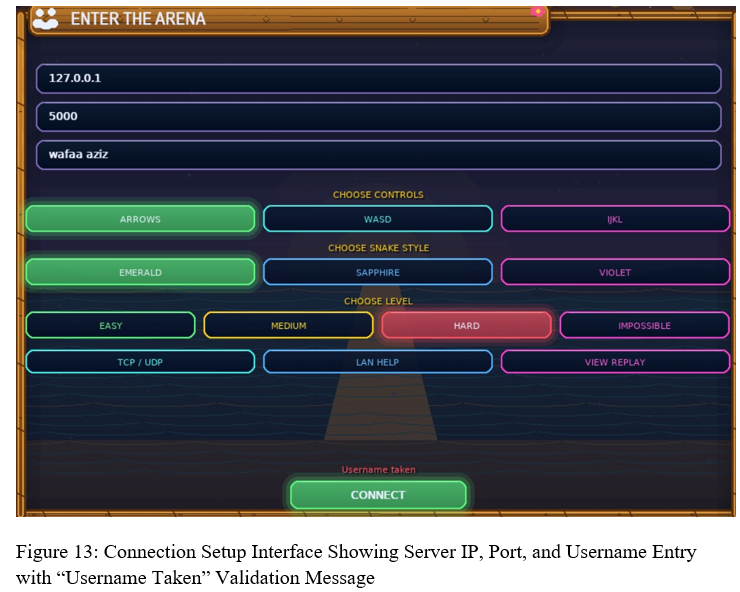
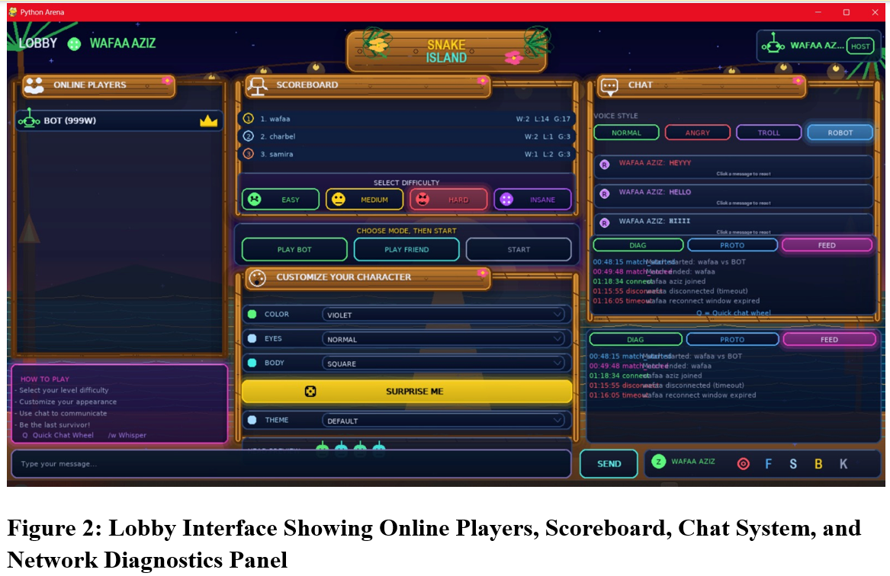
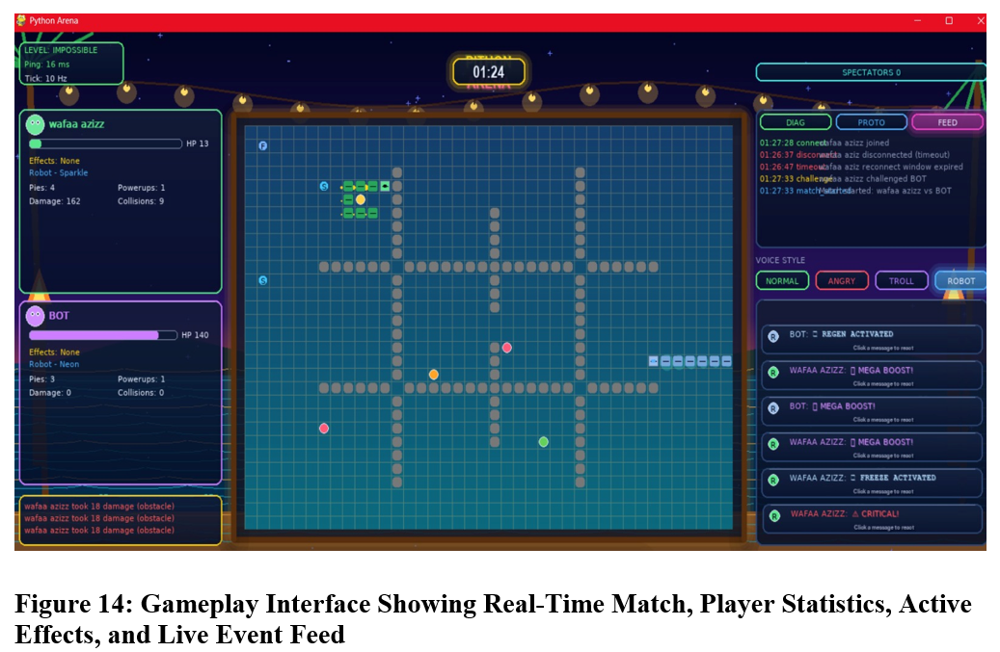
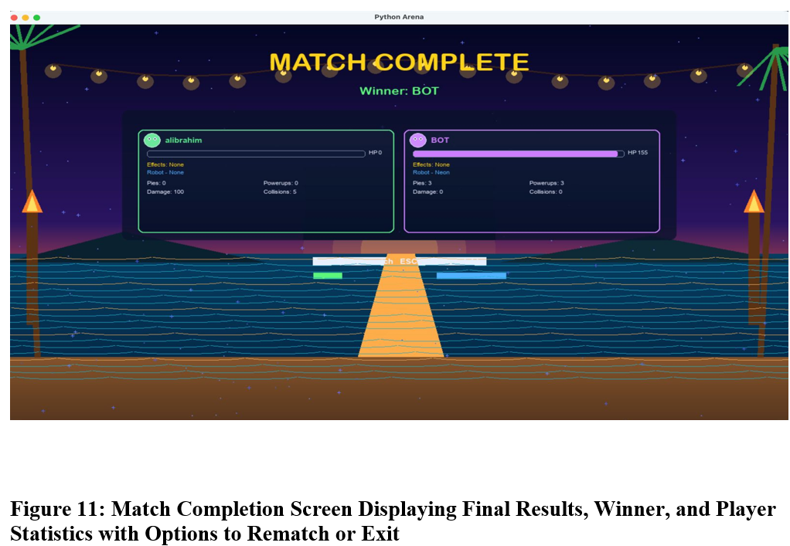
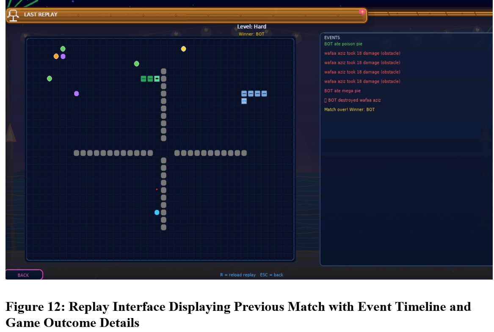
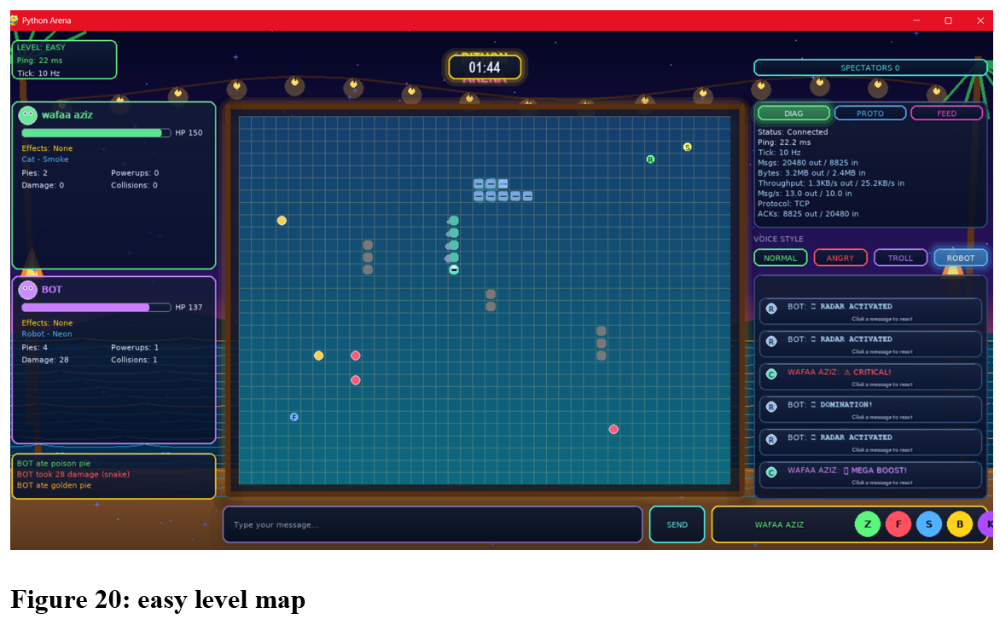
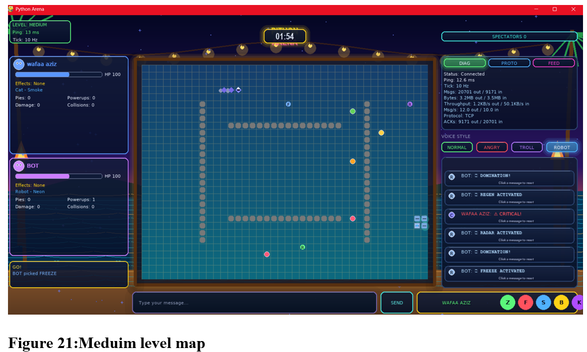
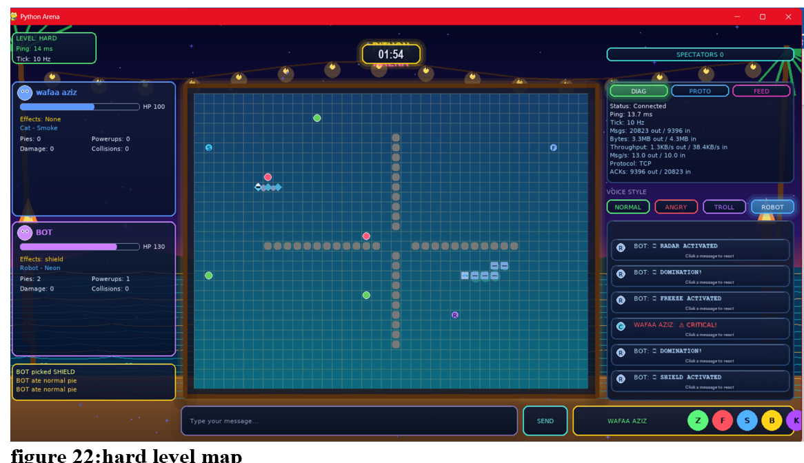
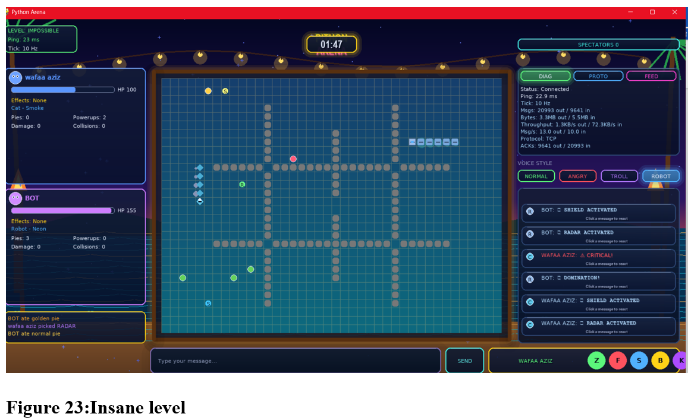

# Python Arena – Real-Time Multiplayer Network Game

## Project Overview

Python Arena is a real-time multiplayer network game developed in Python as part of a Computer and Communications Engineering team project.

The project implements a client-server architecture using TCP socket programming and provides a complete multiplayer gaming experience including matchmaking, real-time gameplay synchronization, chat communication, replay functionality, score tracking, and network diagnostics.

Players can connect to a server, customize their characters, challenge AI opponents, communicate through chat, and compete across multiple difficulty levels and map configurations.

> **Note:** This project was developed collaboratively as a team project.

---

## Features

### Networking
- TCP client-server architecture
- Real-time game state synchronization
- Player connection and disconnection handling
- Ping monitoring and network diagnostics
- Reliable packet delivery using acknowledgments

### Gameplay
- Multiplayer game sessions
- AI Bot opponent
- Multiple difficulty levels:
  - Easy
  - Medium
  - Hard
  - Impossible
- Dynamic obstacle generation
- Real-time player statistics

### Communication
- In-game chat system
- Quick-chat wheel for predefined messages
- Multiple message styles
- Live event feed

### User Experience
- Character customization
- Scoreboard and rankings
- Match history tracking
- Replay viewer
- Graphical user interface

### Monitoring and Diagnostics
- Network statistics panel
- Protocol information panel
- Event logging system
- Server-side monitoring and logging

---

## Technologies Used

- Python
- Socket Programming (TCP)
- JSON
- Object-Oriented Programming (OOP)
- Client-Server Architecture
- Real-Time Networking

### Tools
- Visual Studio Code
- GitHub

---

## Screenshots

### Main Menu


### Connection Setup


### Multiplayer Lobby


### Real-Time Gameplay


### Match Results


### Replay Viewer


---

## Difficulty Levels

### Easy Level


### Medium Level


### Hard Level


### Impossible Level


---

## Installation

### 1. Clone the repository

```bash
git clone https://github.com/your-username/python-arena-network-game.git
cd python-arena-network-game
```

### 2. Install dependencies

```bash
pip install -r requirements.txt
```

---

## How to Run

### Start the Server

```bash
python server.py 5000
```

### Start the Client

```bash
python client.py
```

### Connect

1. Enter the server IP address.
2. Enter the server port.
3. Choose a username.
4. Select controls and difficulty.
5. Connect and start playing.

---

## Project Structure

```text
client.py            # Client application
server.py            # Game server
network.py           # Networking functionality
requirements.txt     # Project dependencies
scoreboard.json      # Scoreboard data
match_history.json   # Match history storage
README.md            # Project documentation
```

---

## Contributors

This project was developed as a team project by Computer and Communications Engineering students.

Contributions included:
- Game development
- Networking implementation
- User interface design
- Testing and debugging
- Documentation

---

## Learning Outcomes

Through this project, we gained practical experience in:

- TCP socket programming
- Client-server application development
- Real-time communication systems
- Network diagnostics and monitoring
- Software testing and debugging
- Collaborative software development
- Python application development

---

## License

This repository is shared for educational and portfolio purposes.
